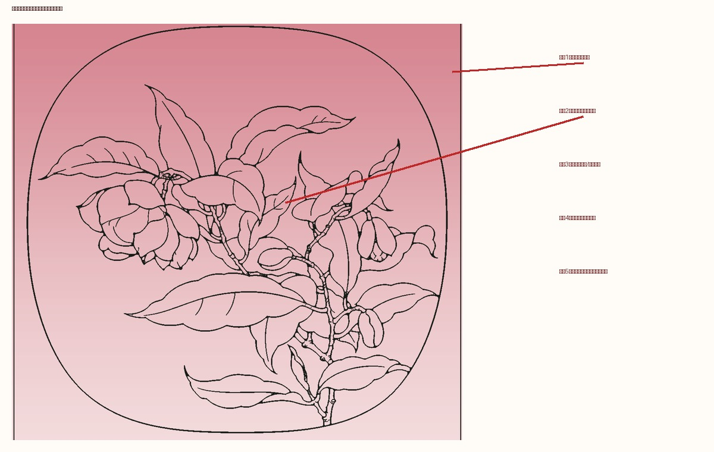
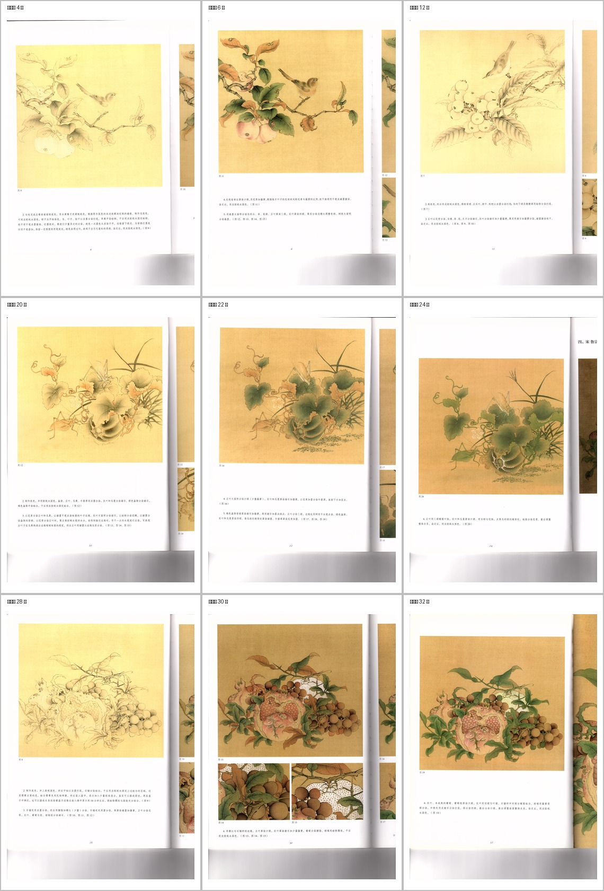
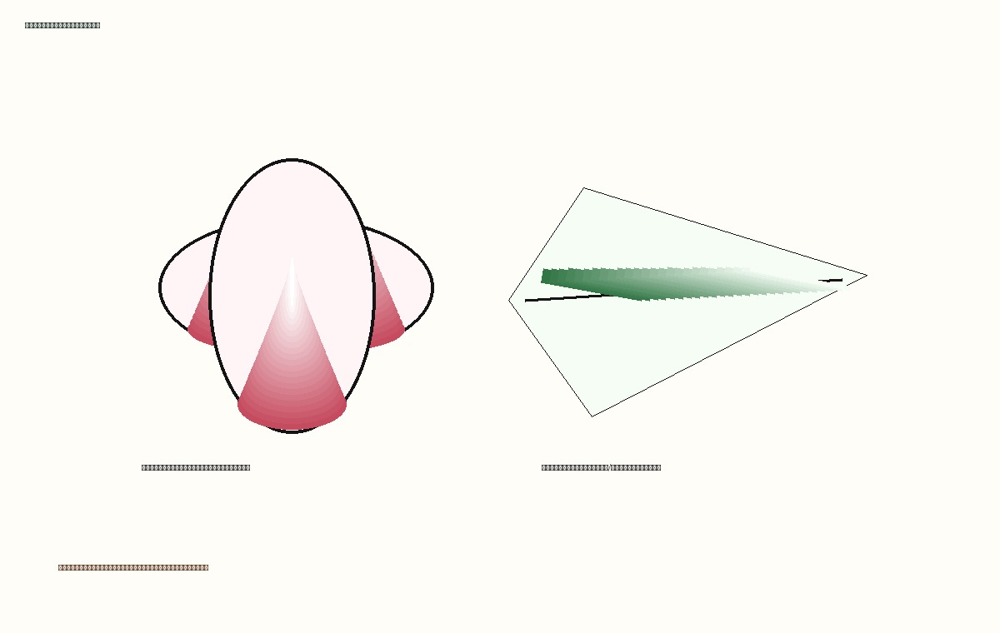

# 分染概念与表现形式报告

## 1. 结论

上一版 `step_05_fenran.png` 不是分染。它的问题是把整张画面铺成粉色渐变，背景、花、叶、枝全部同色处理，没有在具体对象内部根据结构、遮挡、明暗关系做局部分染。

真正的分染不是“整幅上色”，也不是“渐变背景”。它是工笔设色中的局部薄染方法：在白描线限定的对象内部，从需要加深的位置下笔，用极淡颜色逐遍退晕，使颜色从深处向浅处自然过渡。

## 2. 本次依据

本报告重新查看了项目内 33 张教材扫描页及 OCR 技法单元，重点关注含有“分染、罩染、平染、统染、提染、设色、花青、胭脂、藤黄、赭石、淡墨”等词的页面。

重点证据页包括：

- 第 4 页：鸟、叶、枝干用淡墨分染打底，苹果平染赭粉；强调“少量多次分染”，避免一次墨色过浓。
- 第 6 页：鸟的头、身、尾部大面积分染；果实用淡胭红分染调整色相；正叶、反叶用不同罩染。
- 第 12 页：枇杷叶、枝、果先淡赭墨罩染，淡墨分染打底；鸟的下颌及胸腹按明暗关系分染；正叶以花青分染，反叶和果实用赭石加藤黄分染。
- 第 20、22、24 页：瓜果、叶片、地面、虫体等按对象分区分染，正叶、反叶、瓜蔓、地面使用不同处理。
- 第 28、30、32 页：石榴叶用淡墨分染后罩花青；葡萄分染层次；柑橘外侧按淡赭石、四绿、汁绿等层层分染。

## 3. 分染的核心特点

### 3.1 发生在对象内部

分染必须被白描线约束在具体对象内，例如一片叶、一瓣花、一个果实、一段鸟胸腹、一段枝干。背景不应无差别染色，除非步骤文字明确是地面或背景烘染。

### 3.2 从结构深处起色

分染的起点通常是：

- 花瓣根部、花心附近、瓣与瓣重叠处。
- 叶片主脉两侧、叶根、翻折暗面、被遮挡处。
- 果实靠遮挡的一侧、凹陷处、裂口边缘、果蒂附近。
- 鸟的下颌、胸腹转折、翅羽分组、尾羽暗部。
- 枝干节疤、转折、压叠、皴擦处。

### 3.3 由深到浅退晕

分染不是填满。它要求颜色从深处向浅处逐渐淡出，边缘不能形成硬色块。对象内部应有“深处、过渡、留白/浅色”的层次。

### 3.4 少量多次

教材第 4 页明确提示打墨底要少量多次，避免一次墨色过浓而染不开。这意味着程序表现上应使用多层低透明度颜色，而不是一次大面积高透明度覆盖。

### 3.5 与罩染、平染不同

- 平染：相对均匀地铺一个底色，例如苹果平染赭粉。
- 罩染：在已有色层上罩一层整体色相，例如正叶罩染汁绿。
- 分染：在局部暗部、转折、遮挡处做有方向的深浅过渡。
- 提染：在局部进一步提亮或提深，使重点更明确。

## 4. 正确图式

正确的分染示意应该长这样：线稿仍是骨架，颜色只落在对象内部，并且每个对象有自己的起染点、退晕方向和色相。

## 5. 对程序生成的要求

下一版分染程序必须遵守以下规则：

1. 不允许整张画面统一铺色。
2. 不允许背景默认染色。
3. 必须先识别或估计对象区域：花瓣、叶片、果实、枝干、鸟体。
4. 每个对象区域内部单独生成色层。
5. 每个对象至少有“起染区”和“退晕方向”。
6. 白描线必须始终在最上层或清晰可见。
7. 正叶、反叶、花、果、枝、鸟不能使用同一套颜色。
8. 分染步骤图应能看出逐步加深，而不是一张最终铺色图。

## 6. 可执行的程序逻辑

下一版可按以下逻辑生成：

1. 读取白描稿，只作为只读骨架。
2. 将白描线转为黑线透明层，后续叠在最上方。
3. 对线稿进行闭合区域或近似区域分割，得到候选对象块。
4. 根据形状和用户提示粗分对象：长椭圆多为叶，圆形/果形为果，细长连通为枝，小瓣形为花。
5. 对每个对象生成局部分染 mask：
   - 叶：沿主脉或叶根一侧加深，向叶缘淡出。
   - 花瓣：从花心/根部加深，向瓣尖淡出。
   - 果：从遮挡侧、凹陷、果蒂处加深，向受光面淡出。
   - 枝：沿节疤、转折、下侧皴染。
6. 每一步只增加少量透明色层。
7. 输出至少四张图：白描骨架、淡墨/淡色打底、局部分染加深、罩染或整理预览。

## 7. 对当前错误图的修正方向

当前错误图应废弃，不应作为训练或评估样本。它只可作为反例：

- 它没有对象分区。
- 它没有局部起染。
- 它没有退晕方向。
- 它没有区分花、叶、枝、果。
- 它把背景也染了，违背分染步骤图的基本要求。

下一步应先实现“对象内局部分染示意”，即便对象识别粗糙，也必须先做到颜色不出对象、不染背景、不整图同色。
